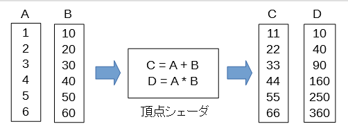


配列の加算と乗算
================

今度は加算と乗算の2つの値を出力してみます。

2個以上の変数に出力するには上記のコードに出力変数の記述を追加するだけです。

以下に追加のコードだけ書きますが、全体のコードはGitHubをご覧ください。

出力変数Dの宣言

.. code-block:: glsl

    out float D;

Dの計算式

.. code-block:: glsl

    D = A - B;

Dの値の配列の作成

.. code-block:: js

    var D = new Float32Array(6);

Dを引数に指定

.. code-block:: js

    args: {
        "A": A,
        "B": B,
        "C": C,
        "D": D,
    }

1つ注意すべき点は、 **入力変数と出力変数の要素の数はすべて同じ** というきまりがあることです。
この例ではA,B,C,Dの各配列の要素数はすべて6になっています。
