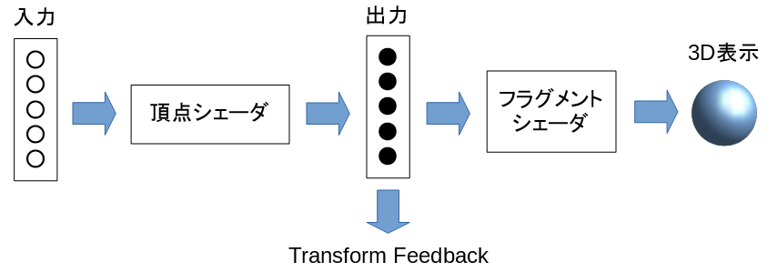

WebGL 2.0でのGPGPUのしくみ
==========================

WebGLの通常の3D表示の処理の流れは以下のようになります。

1. 3Dオブジェクトの頂点の位置、色などを **頂点シェーダ** と呼ばれるプログラムに入力します。
2. 頂点シェーダは座標変換などの計算をして出力します。
3. 頂点シェーダの出力は **フラグメントシェーダ** と呼ばれるプログラムに渡されます。
4. フラグメントシェーダは画面の画素ごとの色を計算して3D表示をします。

WebGLでは2.0から **Transform Feedback** という機能が追加され、頂点シェーダの出力をアプリ側で受け取れるようになりました。

頂点シェーダの入力,計算内容,出力はアプリで自由に制御できるので、この仕組みを使ってGPUに数値計算をさせて結果を受け取れます。

ちなみにGPGPUをする場合は、フラグメントシェーダの出力を無効にするようWebGLに指示するので画面には何も表示されません。

フラグメントシェーダの出力を有効にして計算結果を3D表示することも可能です。