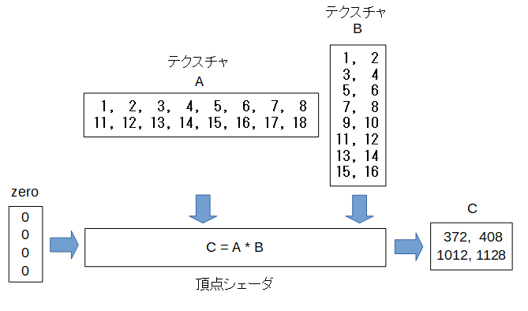


テクスチャ
============

uniform変数で使える配列のサイズは数KB～数10KBですので大きなデータを扱いたい場合はテクスチャを使います。

例として以下の行列のかけ算をテクスチャでしてみます。

.. math::

    \begin{pmatrix} 1 & 2 & 3 & 4 & 5 & 6 & 7 & 8 \\ 11 & 12 & 13 & 14 & 15 & 16 & 17 & 18 \end{pmatrix}
    \begin{pmatrix} 1 & 2 \\ 3 & 4 \\ 5 & 6 \\ 7 & 8 \\ 9 & 10 \\ 11 & 12 \\ 13 & 14 \\ 15 & 16 \end{pmatrix}
    =
    \begin{pmatrix} 372 & 408 \\ 1012 & 1128 \end{pmatrix} 

プログラムの構成は以下のようになります。

今回は入力変数の値は使わないのですが、 **入力変数と出力変数の要素の数は同じ** という原則があるので出力変数Cの要素数4と同じサイズの配列で中身の値は0の入力変数zeroを使っています。

頂点シェーダではテクスチャの値を取ってくるのにsamplerというのを使います。

今回のテクスチャは2次元配列なので使うのはsampler2Dです。

.. code-block:: glsl

    uniform sampler2D A;
    uniform sampler2D B;
    out float C;

頂点シェーダのプログラムはこれまでと比べてかなり長いですが以下の処理をしています。

1. 出力する行列Cの行(row)と列(col)を計算します。
2. Aのrow行のベクトルとBのcol列のベクトルの内積を計算して出力します。

.. code-block:: glsl

    void main() {
        // テクスチャBの行数と列数を取得します。
        // B_sz.yが行数、B_sz.xが列数です。
        ivec2 B_sz = textureSize(B, 0);

        // 出力する行列Cの行(row)と列(col)を計算します。
        // gl_VertexIDは入力変数の何番目の要素かを示すシステム変数です。
        int row = gl_VertexID / B_sz.x;
        int col = gl_VertexID % B_sz.x;

        // Cのrow行col列の値は、Aのrow行のベクトルとBのcol列のベクトルの内積です。

        // 以下のループでベクトルの内積を計算します。
        float sum = 0.0f;
        for(int i = 0; i < B_sz.y; i++) {

            // Aのrow行i列の値を取得します。
            vec4 a = texelFetch(A, ivec2(i, row), 0);

            // Bのi行col列の値を取得します。
            vec4 b = texelFetch(B, ivec2(col, i), 0);

            // a.rとb.rに取得した値が入っています。
            sum += a.r * b.r;
        }

        // 入力変数zeroの値は必要ないですが、使用しない変数はコンパイラが除去してしまいエラーになるので形の上だけ使用します。
        // zeroの値は0なので計算結果には影響しません。
        C = sum + zero;
    }

テクスチャの処理にはテクスチャの要素の型と行数と列数がなので、 **makeTextureInfo** というメソッドを使ってこれらを指定します。
以下の例ではAはfloatの2行8列のテクスチャ、Bはfloatの8行2列のテクスチャを指定します。

.. code-block:: js

    args: {
        "zero": new Float32Array(4),
        "A": gpgpu.makeTextureInfo("float", [2, 8], A),
        "B": gpgpu.makeTextureInfo("float", [8, 2], B),
        "C": C,
    }

テクスチャの要素の型には **float,vec2,vec3,vec4** が使えます。

なお、テクスチャは2次元と3次元だけで1次元のテクスチャはありません。

1次元のテクスチャを使いたい場合は、1行n列のように2次元のテクスチャで代用します。
