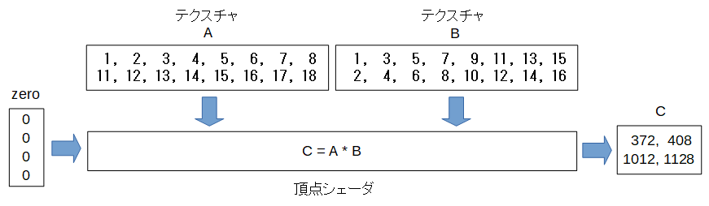


行列の積の高速化
====================

GPUには多数の計算ユニットがあり計算は高速なのですがメモリの通り道(メモリバス)は1つしかないので、多数の計算ユニットが一斉にメモリ内のあちこちを参照するとたちまち渋滞がおきてしまいます。

頂点シェーダで連続したメモリ領域をアクセスすることにより、ブロック単位でメモリ転送が行われ処理速度の向上が期待できます。

そこでテクスチャBの配置を以下のように変えてみます。

数学的にはBは行と列が入れ替わった転置行列になっています。

こうすると例えばCの1行1列の値は以下のようになり、メモリ内の連続した領域をアクセスするようになりました。

.. math::

    C_{1,1} = (1, 2, 3, 4, 5, 6, 7, 8) \cdot (1, 3, 5, 7, 9, 11, 13, 15)

テクスチャの値は **vec4** として4次元のベクトルとしてアクセスでき、 **vec4** の内積を使い以下の計算をしています。

.. math::

    C_{1,1} = (1, 2, 3, 4) \cdot (1, 3, 5, 7) + (5, 6, 7, 8) \cdot (9, 11, 13, 15)

頂点シェーダのコード
^^^^^^^^^^^^^^^^^^^^

.. code-block:: glsl

    in float zero;

    // 2次元配列のテクスチャ
    uniform sampler2D A;
    uniform sampler2D B;

    // 出力変数C
    out float C;

    void main() {
        // テクスチャBの行数と列数を取得します。
        // B_sz.yが行数、B_sz.xが列数です。
        ivec2 B_sz = textureSize(B, 0);

        // 出力する行列Cの行(row)と列(col)を計算します。
        // gl_VertexIDは入力変数の何番目の要素かを示すシステム変数です。
        int row = gl_VertexID / B_sz.y;
        int col = gl_VertexID % B_sz.y;

        // Cのrow行col列の値は、Aのrow行のベクトルとBのcol行のベクトルの内積です。

        // 以下のループでベクトルの内積を計算します。
        float sum = 0.0f;
        for(int i = 0; i < B_sz.x; i++){

            // Aのrow行i列の値を取得します。
            vec4 a = texelFetch(A, ivec2(i, row), 0);

            // Bのcol行i列の値を取得します。
            // !!!!! 前回はi行col列なので ivec2(col, i) でした。   !!!!!
            // !!!!! 今回は転置したので行と列が入れ替わっています。!!!!!
            vec4 b = texelFetch(B, ivec2(i, col), 0);

            sum += dot(a, b);
        }

        // 入力変数zeroの値は必要ないですが、使用しない変数はコンパイラが除去してしまいエラーになるので形の上だけ使用します。
        // zeroの値は0なので計算結果には影響しません。
        C = sum +zero;
    }

以下はJavaScript側でBの値をセットするコードです。

前回のサンプルでは [1, 2, 3, 4, 5, 6, 7, 8, 9, 10, 11, 12, 13, 14, 15, 16] を入れていました。

今回は値を転置して入れています。

.. code-block:: glsl

    var B = new Float32Array([1, 3, 5, 7, 9, 11, 13, 15, 2, 4, 6, 8, 10, 12, 14, 16]);

サンプルのURL
    http://lkzf.info/gpgpu.js/samples/TexMulMatVec4.html