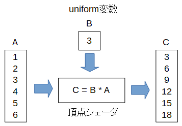


uniform変数
============

各要素の計算をするときに共通の変数の値を使いたいときは、 **uniform変数** というのを使います。

uniform変数は以下のように **uniform** を付けて宣言します。

.. code-block:: glsl

    uniform float B;

JavaScript側からは以下のように数値を渡します。

.. code-block:: js

    var B = 3;
