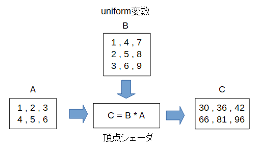


行列とベクトルの乗算
========================

今度はuniform変数に行列を入れ、入力変数のベクトルとかけ算をしてみます。

実はこれが頂点シェーダの本来の使い方で、3D表示では座標変換行列を頂点の位置ベクトルにかけてスクリーン座標に変換しています。

１つ注意しなければならないのは、WebGLでは **[1, 2, 3, 4, 5, 6, 7, 8, 9]** の値を3x3の行列(mat3)に入れると、以下のように行列の列ごとに値が入ることです。

.. math::

    \begin{pmatrix} 1 & 4 & 7 \\ 2 & 5 & 8 \\ 3 & 6 & 9 \end{pmatrix}

このような方式を **column-major order** と言います。

Cなど他の多くのプログラミング言語は **row-major order** で、その場合は以下のように行列の行ごとに値が入ります。

.. math::

    \begin{pmatrix} 1 & 2 & 3 \\ 4 & 5 & 6 \\ 7 & 8 & 9 \end{pmatrix}

uniform変数Bの行列を入力変数Aの最初のベクトル **(1,2,3)** をかけると入力変数Cの最初のベクトルは **(30,36,42)** になります。

.. math::

    \begin{pmatrix} 1 & 4 & 7 \\ 2 & 5 & 8 \\ 3 & 6 & 9 \end{pmatrix}
    \begin{pmatrix} 1 \\ 2 \\ 3 \end{pmatrix}
    =
    \begin{pmatrix} 1 * 1 + 4 * 2 + 7 * 3 \\ 2 * 1 + 5 * 2 + 8 * 3 \\ 3 * 1 + 6 * 2 + 9 * 3 \end{pmatrix}
    =
    \begin{pmatrix} 30 \\ 36 \\ 42 \end{pmatrix}

同様に入力変数Aの2番目のベクトル **(4,5,6)** をかけると入力変数Cの2番目のベクトルは **(66,81,96)** になります。

.. math::

    \begin{pmatrix} 1 & 4 & 7 \\ 2 & 5 & 8 \\ 3 & 6 & 9 \end{pmatrix}
    \begin{pmatrix} 4 \\ 5 \\ 6 \end{pmatrix}
    =
    \begin{pmatrix} 1 * 4 + 4 * 5 + 7 * 6 \\ 2 * 4 + 5 * 5 + 8 * 6 \\ 3 * 4 + 6 * 5 + 9 * 6 \end{pmatrix}
    =
    \begin{pmatrix} 66 \\ 81 \\ 96 \end{pmatrix}

頂点シェーダのコード
^^^^^^^^^^^^^^^^^^^^

.. code-block:: glsl

    // 入力変数A
    in  vec3 A;

    // uniform変数B
    uniform  mat3 B;

    // 出力変数C
    out vec3 C;

    // 要素ごとに呼ばれる関数。
    void main(void ) {
        C = B * A;
    }

入力変数Aと出力変数Cはvec3, uniform変数Bはmat3です。
Cの計算式は同じですが、今回は行列とベクトルのかけ算になります。

サンプルのURL
    http://lkzf.info/gpgpu.js/samples/UniMulMat.html
